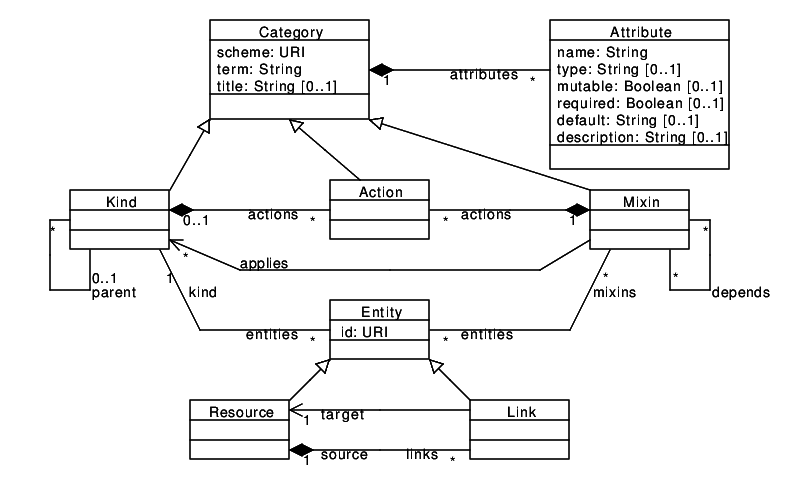

## Presentation

The Open Cloud Computing Interface ([OCCI](http://occi-wg.org/)) is a
specification of REST API from [OGF](http://ogf.org/). It defines
precisely how to model REST resources and exposes them on as a REST
API.

OCCI specifications are made up of 3 parts:

* the [meta-model](http://ogf.org/documents/GFD.183.pdf): provides
  conceptual tools for describing resources' types (aka categories) and
  links between them;

* renderings: describes how resources are exposed with
  [HTTP](http://ogf.org/documents/GFD.185.pdf) protocol or
  another. Actually, only HTTP has been officially described but
  erocci implements an experimental XMPP rendering.

* models: OCCI was originally designed for cloud computing so it
  provides also a specification for OpenStack-like APIs. This is known
  as [Infrastructure spec](http://ogf.org/documents/GFD.184.pdf). This
  is a good example of an OCCI model.

Figure below illustrates the OCCI meta-model.

## The OCCI HTTP Rendering

### Capabilities

TODO (/-/, mixins, ...)

### Collections

TODO

### Creating Resources

TODO

### Updating Resources

TODO

### Deleting Resources

TODO

### Retrieving Resources

TODO

### Searching - Filtering - Pagination

TODO
